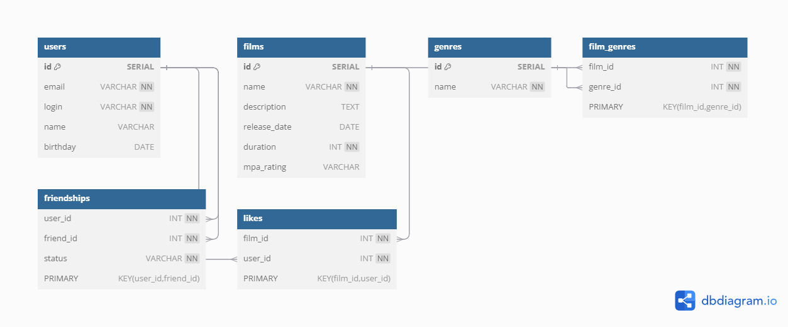

# Filmorate

Filmorate — это приложение для работы с пользователями и фильмами. 
Пользователи могут ставить лайки фильмам, добавлять друзей и смотреть список общих друзей. 
Приложение также позволяет управлять фильмами, жанрами и хранить связи между ними.

---

## Схема базы данных

Ниже представлена схема базы данных для приложения:

### Таблицы

1. **users** — хранит информацию о пользователях.
2. **films** — хранит информацию о фильмах.
3. **genres** — хранит список возможных жанров фильмов.
4. **film_genres** — связывает фильмы с жанрами (отношение многие ко многим).
5. **friendships** — хранит дружеские связи между пользователями.
6. **likes** — фиксирует лайки пользователей для фильмов.

---

## SQL-схема базы данных

Файл со схемой базы данных доступен по ссылке: [schema.sql](./docs/postgresql_schema.png)

---

## Примеры запросов

### Получение всех пользователей:
SELECT * FROM users;

### Получение списка всех жанров:
SELECT * FROM genres;

### Добавление нового фильма:
INSERT INTO films (name, description, release_date, duration, mpa_rating)
VALUES ('Новый фильм', 'Описание фильма', '2023-10-10', 120, 'PG-13');

### Получение топ N популярных фильмов:
SELECT f.id, f.name, COUNT(l.user_id) AS likes_count
FROM films f
LEFT JOIN likes l ON f.id = l.film_id
GROUP BY f.id
ORDER BY likes_count DESC
LIMIT N;

### Список общих друзей между двумя пользователями:
SELECT u.id, u.name
FROM friendships f1
INNER JOIN friendships f2 ON f1.friend_id = f2.friend_id
INNER JOIN users u ON f1.friend_id = u.id
WHERE f1.user_id = $1 AND f2.user_id = $2 AND f1.status = 'CONFIRMED' AND f2.status = 'CONFIRMED';
